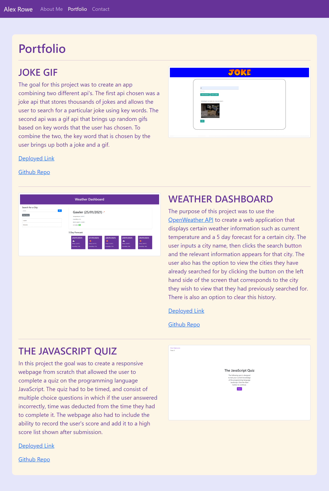

# bootcamp-hwk-wk2-AHR

## Description

This project is very simple portfolio website made using only html, bootstrap css and some (minimal) custom css. The three pages created
were index.html, portfolio.html and contact.html. The index.html page includes an "About Me" section, with a profile photo and links to my
LinkedIn and GitHub profiles. The portfolio.html page includes a few images of previous projects I have worked on, and the contact.html
contains a non-functioning contact form. All pages contain a navbar that has links to each page.

## Screenshots

## Links

- Repo (Yes this one): https://github.com/TopGek99/bootcamp-hwk-wk2
- Webpage: https://topgek99.github.io/bootcamp-hwk-wk2-AHR/
