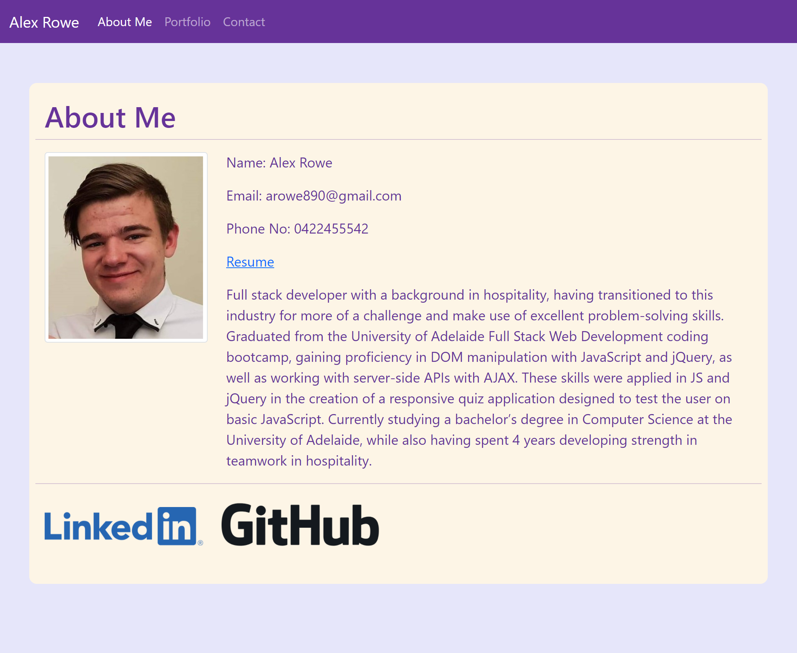

# responsive-portfolio

## Description

This project is very simple portfolio website made using only html, bootstrap css and some (minimal) custom css. The three pages created
were index.html, portfolio.html and contact.html. The index.html page includes an "About Me" section, with a profile photo and links to my
LinkedIn and GitHub profiles. The portfolio.html page includes a few images of previous projects I have worked on, and the contact.html
contains a non-functioning contact form. All pages contain a navbar that has links to each page.

Update: The following changes changes were made to the page:

- There is now only one html file (index.html) and all of the information that was previously spread across 2 other pages is now reached via jQuery DOM manipulation
- Name, email, phone number and a Resume link have been added to the bio
- The bio has been shortened to one paragraph
- The portfolio section has been updated with details of 3 exemplary projects, including a description, a deployed URL, a GitHub repo link and a screenshot for each
- When the screen size is reduced to below 600px, the three navbar links are condensed into a dropdown menu
- An updated colour scheme

## Technologies

- HTML
- CSS
- Bootstrap CSS
- JavaScript
- jQuery

## Screenshots

## Links

- [Repo (Yes this one)](https://github.com/TopGek99/responsive-portfolio)
- [Webpage](https://topgek99.github.io/responsive-portfolio)

## Credits

[Me](https://github.com/TopGek99/)

## License

